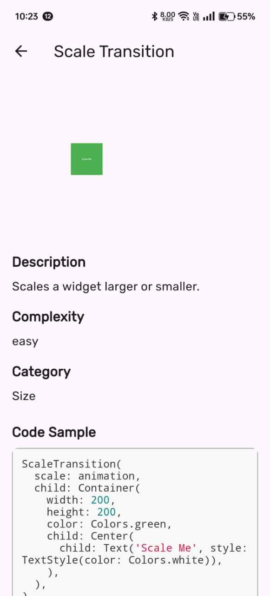
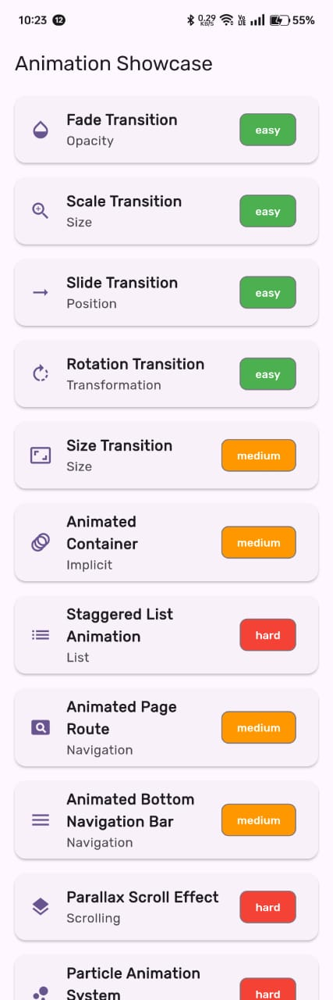

# Flutter Animation Showcase

This project is a comprehensive showcase of various animations in Flutter, designed to help developers understand and implement different types of animations in their own projects.

## Features

- Showcases 11 different types of animations
- Detailed explanation of each animation
- Live demo of each animation
- Code samples for easy implementation

## Animations Included

1. Fade Transition
2. Scale Transition
3. Slide Transition
4. Rotation Transition
5. Size Transition
6. Animated Container
7. Staggered List Animation
8. Animated Page Route
9. Animated Bottom Navigation Bar
10. Parallax Scroll Effect
11. Particle Animation System

## Screenshots

<table>
  <tr>
    <td></td>
    <td></td>
  </tr>
</table>

## Getting Started

To run this project:

1. Ensure you have Flutter installed on your machine
2. Clone this repository
3. Run `flutter pub get` to install dependencies
4. Run `flutter run` to start the app

## Dependencies

- flutter_highlight: ^0.7.0
- google_fonts: ^2.3.0

## Contributing

Contributions are welcome! Please feel free to submit a Pull Request.

## License

This project is open source and available under the [MIT License](LICENSE).